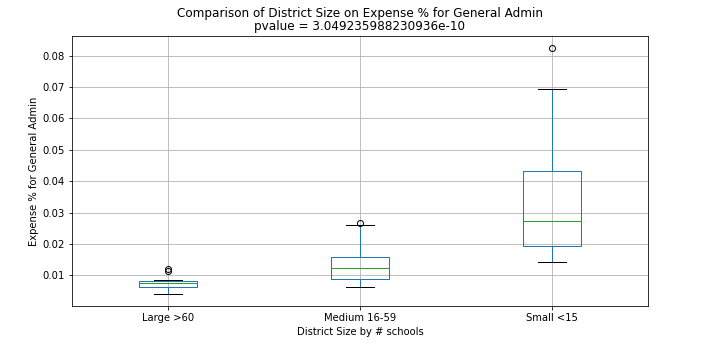
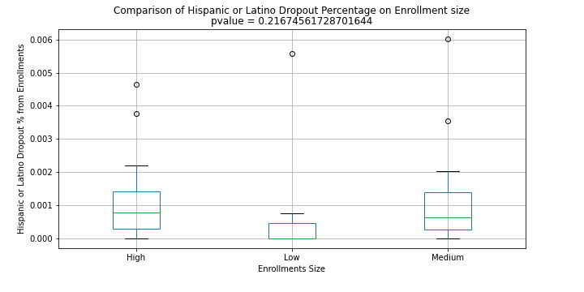
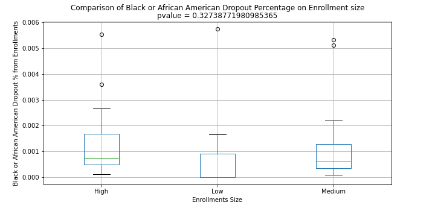

# School dropout rates in Florida for school year 2014

### The Team
JJ Williams (Data Import & Financial Analysis), Tabitha Head (Demographic Analysis), Altricia Latimer (Teacher Analysis)

### Project Description
The project will investigate Florida and National education data sets to determine if there are potential factors that could lead to a higher drop rate in individual school districts.  It will compare all school districts offering PreK - 12 grade analyzing dropout rates with teacher, demographic, and district funding factors.

### Gathering the Data
To gather all the information, we needed for analysis regarding teacher, student demographics and district funding factors we needed to pull the data from multiple sources.  We utilized the API provided by [Urban Institute Education Data Portal](https://educationdata.urban.org/data-explorer/) to pull only the school district information we wanted such as staff breakdown, enrollment, number of schools, financials, and poverty estimates from the National Center of Education Statistics Common Core data, US Census Bureau’s Small Area Income and Poverty Estimates. In addition, we imported excel files regarding dropout rates, +21 absents, enrollment by race, teachers, and free/reduced lunch from the [Florida Department of Education](http://www.fldoe.org/accountability/data-sys/edu-info-accountability-services/pk-12-public-school-data-pubs-reports/archive.stml). In 2015, the Florida Department of Education changed their dropout reporting to Cohort focus instead of individual year reporting and since in this analysis we were not looking at multiple years we selected the year 2014 for all of our data.
#
### Financial Analysis Chart Examples
 

 

### Demographic Analysis Chart Examples
  

### Teacher Analysis Chart Examples

